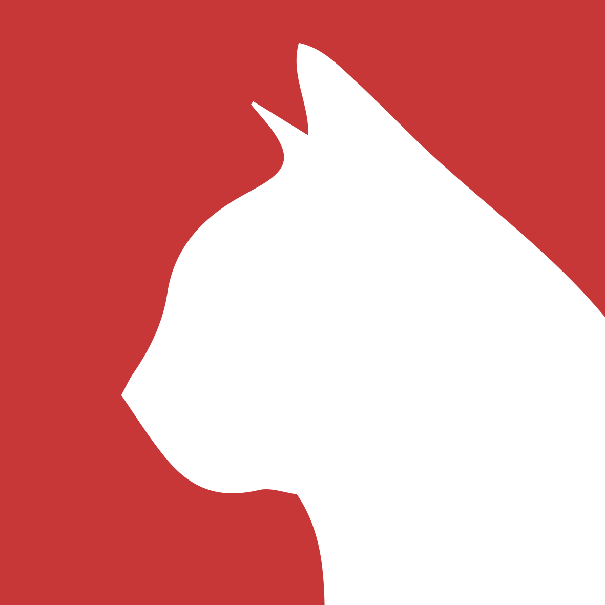

# Pintecat

a [Pinterest](https://www.pinterest.com/) style app that brings cat-lovers the two things they love most:
- Good old fashioned cat pictures/gifs; and
- Cat facts

This is a "Cats Project" challange from "Bento for Business".

## Installation

### Clone / Download

- clone or download this repo to your local machine. 

### Setup

> on your terminal go to the root and install the package first

```shell
$ npm install
```
> then run the the proxy server (cors-anywhere)

```shell
$ node server.js
```

> open another terminal in the client (pintecatfront) and run

```shell
$ npm start
```

## Authors

* **Eran Dromy** - *Front End Development, Graphics* - [GitHub](https://github.com/erandro)

